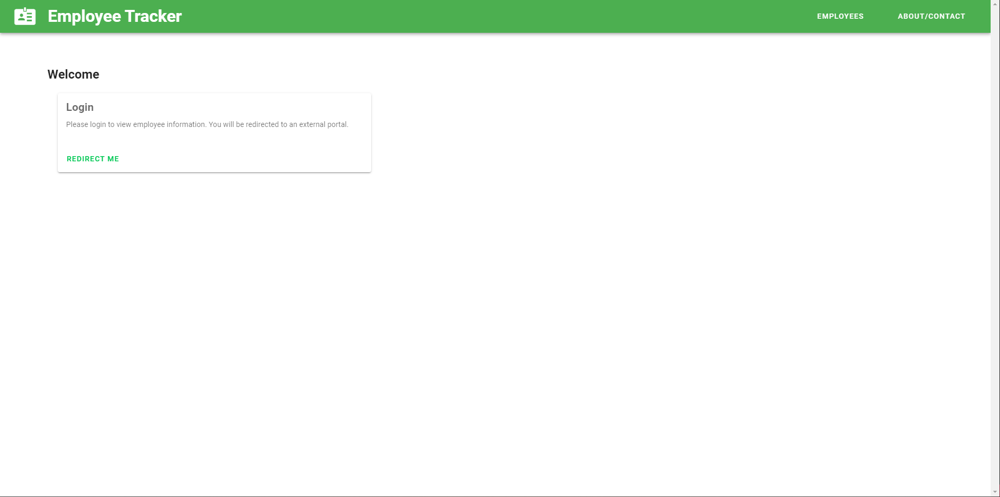
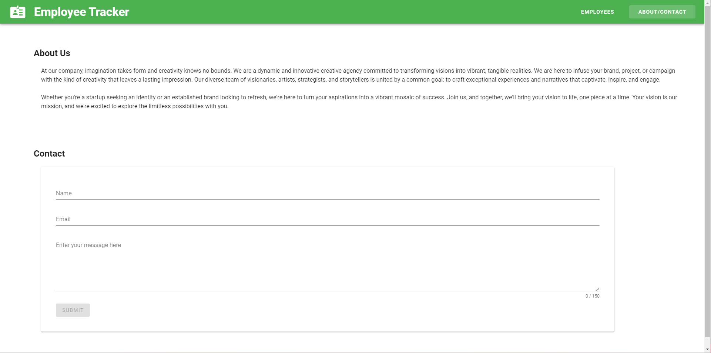
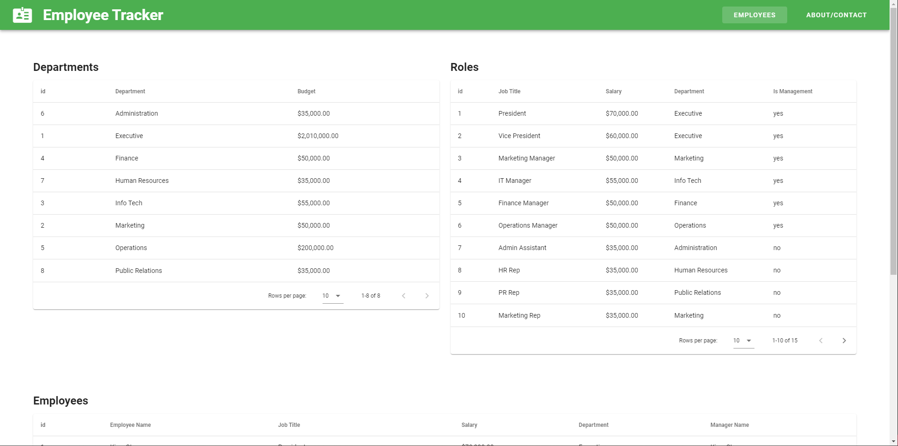

  # Vuetify2 IdentityServer4 Employee Tracker
    
    
  This C# IdentityServer4 application uses a .Net Core mock backend and Vue 2 Vuetify frontend to host an employee tracker. The application uses IdentityServer4 OpenId authorization and authentication to protect routes, and allows users to view unprotected routes without logging in or to login to view extended and protected employee information. This application does not contain a database, uses frontend JavaScript to mimic table joins, and is considered a mock practice application.
  
  ## Table of Contents
  
  * [Installation](#installation)
  * [Built With](#built)
  * [Usage Information](#usage)
  * [Authors & Acknowledgements](#credits)
  * [License](#license)
  * [Contact](#questions)

  ## Installation
  After cloning the repository, use npm to install dependencies for the frontend client and run "npm run serve" to run the Vue 2 + Vuetify frontend. In Visual Studio, run the server to serve mock data.

  ## Built With
  * IdentityServer4
  * Vue 2
  * Vuetify 2
  * C#
  * .Net Core
  * JS
  
  ## Usage Information
  This application is a mock practice application. 
    
    
    
  
  ## Authors & Acknowledgements
  Resources and special thanks to: 
Mock data retrieved from [this](https://github.com/TOVTC/employee-tracker-scscbc-challenge) challenge assignment, with raw data from [this](https://gist.github.com/kevin336/acbb2271e66c10a5b73aacf82ca82784) GitHub Gist by Kevin336 
Basic [CSV to JSON algo](https://stackoverflow.com/questions/28543821/convert-csv-lines-into-javascript-objects) by nanndoj 
rominator007's answer [here](https://stackoverflow.com/questions/40155182/asp-net-core-default-route) on how to set a default view route 
IdentityServer4 setup following the official documentation [here](https://identityserver4.readthedocs.io/en/latest/quickstarts/0_overview.html) until incorporating Vue.js, wherein instructions by Richard Banks [here](https://www.richard-banks.org/2018/11/securing-vue-with-identityserver-part1.html) were roughly followed 
About Us placeholder text sourced from a template at Render Forest [here](https://www.renderforest.com/website-maker/new/lang/preview-project/template/297?backUrl=websites) 
[CORS](https://learn.microsoft.com/en-us/aspnet/core/security/cors?view=aspnetcore-7.0) 
[StandardScopes](https://stackoverflow.com/questions/72018051/error-scope-identityserverapi-not-found-in-store)
  
  Made by [TOVTC](https://github.com/TOVTC).
  
  ## License
  This application uses the MIT License. For more information regarding usage, please visit [this link](https://opensource.org/licenses/MIT).
  
  ## Questions?
  Contact repository author via [GitHub](https://github.com/TOVTC). 
    
  
  